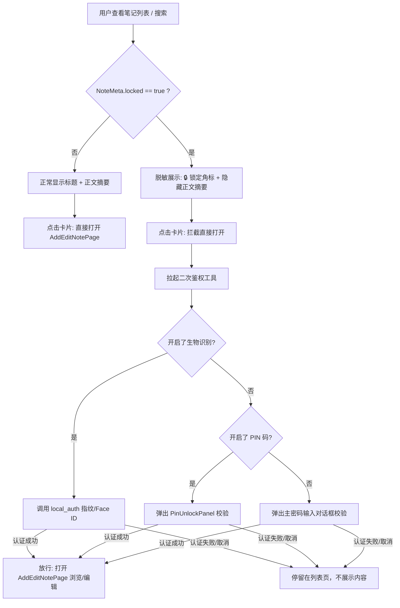

# 笔记隐私真锁定（防窥锁定）设计方案

> 立项时间：2026-08-24
> 目标：将现有的“只读锁定”升级为真正的“隐私防窥锁定（真锁定）”，防止手机借给他人时被瞄到或点开私密笔记内容。

---

## 1. 背景与目标

### 1.1 现状分析
当前 SafeNotes 的“笔记锁定”功能本质上是**只读保护**：
- `NoteMeta.locked` 为 `true` 时，仅在编辑页（`AddEditNotePage`）中隐藏了编辑入口与工具栏，强制以只读 Markdown 渲染展示。
- **痛点**：在首页列表、紧凑列表、桌面端列表以及搜索结果中，笔记的标题和正文摘要（`abstractText`）依然**明文全部可见**；任何人点击卡片均可直接点开查看全部内容，无法起到“防身边人借用手机偷窥”的作用。

### 1.2 为什么采用轻量访问控制方案？
- **底层已具备全盘强加密**：SafeNotes 本地 SQLite 数据库与 Payload 在磁盘上已经全部经过 AES-256-GCM + PBKDF2 强加密，离线提取数据库无法获取任何明文。
- **无需独立二次密钥派生**：在应用内对单篇笔记做独立的额外加密既增加密钥管理复杂度，也会导致多设备同步、密码丢失恢复等一系列困难。
- **业界通用标准**：类似 Apple Notes、Samsung Notes 与 1Password，应用内的单篇隐私笔记锁定本质上是**访问控制闸门（Access Gate）**。通过**列表脱敏展示 + 进入时拉起生物识别/PIN/主密码二次鉴权**，即可在极低开发与维护成本下完美实现防窥与隐私保护。

---

## 2. 核心交互流程

---

## 3. 详细设计方案

### 3.1 列表与卡片脱敏展示
涉及组件：`lib/widgets/note_card_body.dart` 以及外壳组件（`note_card.dart`、`note_tile.dart`、`note_card_compact.dart`、`note_tile_compact.dart`）。

1. **正文摘要脱敏**：
   - 当 `isLocked == true` 时，不展示 `note.abstractText`，替换为脱敏提示占位文本：`🔒 Locked note`（支持多语言 `Locked note`.tr()）。
2. **锁定角标指示**：
   - 在卡片标题旁或角标区域展示小锁图标 🔒（类似于现有的置顶星标 `_PinnedBadge`），让用户直观识别哪些笔记已受保护。

### 3.2 打开笔记时的二次鉴权拦截
涉及组件：`lib/views/home.dart` & `lib/widgets/search_widget.dart`。

1. **统一鉴权助手（`lib/utils/auth_helper.dart` 或扩展现有 auth 模块）**：
   - 提供通用异步方法 `Future<bool> authenticateForLockedNote(BuildContext context)`。
   - **鉴权优先级**：
     1. **生物识别**（首选）：若 `PreferencesStorage.isBiometricAuthEnabled` 为 true，调起 `LocalAuthentication` 进行指纹/面容校验（1秒无感秒开）；
     2. **PIN 码**（次选）：若 `PreferencesStorage.isPinAuthEnabled` 为 true，弹出已有 `PinUnlockPanel` 校验；
     3. **主密码**（兜底）：若上述均未开启，弹出一个轻量的密码确认对话框，比对 `PhraseHandler.getPass` 或 `Keyring`。
   - 鉴权成功返回 `true`，失败或用户取消返回 `false`。

2. **点击拦截**：
   - 在 `home.dart` 的卡片点击处理（`_openNoteEditorContainer` / `OpenContainer`）及搜索列表点击时：
     - 若 `locked == false`，直接导航进入；
     - 若 `locked == true`，先 `await authenticateForLockedNote(context)`，仅在返回 `true` 时才触发页面 push。

### 3.3 详情页与操作菜单（AddEditNotePage & NoteActionsSheet）
1. **浏览与编辑权限**：
   - 既然用户已通过二次身份验证进入笔记详情页，表明其为合法使用者：
     - 允许正常查看全部正文 Markdown 渲染与编辑；
     - 退出该页面（pop）后，笔记在列表中自动恢复锁定脱敏状态，无需手动二次上锁。
2. **锁定/解锁切换**：
   - 在 `NoteActionsSheet` 中点击“解除锁定”或“锁定笔记”时，保持快捷切换；若需要防止误解锁，可结合轻量确认弹窗。

### 3.4 搜索脱敏与批量操作
1. **全局搜索（`search_widget.dart`）**：
   - 搜索时可正常在内存中全文匹配，但在搜索结果列表中，针对锁定笔记隐藏匹配正文高亮片段，仅展示标题与锁定占位符；点击结果同样触发二次鉴权拦截。
2. **批量多选操作（`home.dart`）**：
   - 多选工具栏中的批量锁定/批量解锁，批量解锁时建议拉起一次身份验证确认后执行。

---

## 4. 文件改动范围预估

| 文件路径 | 改动性质 | 改动说明 |
| :--- | :--- | :--- |
| `lib/utils/auth_helper.dart` | **新建** | 封装统一的 `authenticateForLockedNote` 二次鉴权助手 |
| `lib/widgets/note_card_body.dart` | **修改** | 增加 `isLocked` 参数；锁定状态下摘要脱敏为 `🔒 Locked note` 并展示锁角标 |
| `lib/widgets/note_card*.dart` / `note_tile*.dart` | **修改** | 透传 `isLocked` 参数至 `NoteCardBody` |
| `lib/views/home.dart` | **修改** | 卡片点击打开前增加 `isLocked` 鉴权拦截；批量解锁加鉴权 |
| `lib/widgets/search_widget.dart` | **修改** | 搜索列表锁定笔记摘要脱敏，点击结果加鉴权拦截 |
| `lib/views/add_edit_note.dart` | **修改** | 调整详情页在通过鉴权后的编辑/只读体验与指示器 |
| `assets/translations/{zh-CN,en-US}.json` | **修改** | 补充/确认锁定防窥相关提示文案（如 `Unlock locked note` 等） |

---

## 5. 方案优势总结

1. **零数据迁移风险**：完全复用现有的 `NoteMeta.locked` 数据库字段与同步逻辑，无需修改 SQLite schema，多端同步无破坏。
2. **极佳的用户体验**：默认支持系统级指纹/Face ID，秒开不繁琐，防窥效果立竿见影。
3. **改动聚焦、代码量极小**：核心逻辑集中在 UI 渲染脱敏与打开拦截，改动清晰可控，便于单元测试与自动化测试覆盖。
