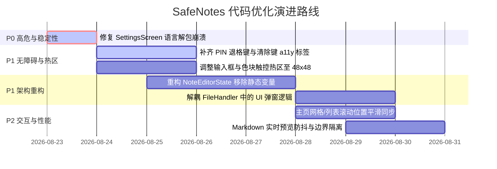

# SafeNotes Flutter 代码全面审查与优化建议报告（2026-08-23）

## 一、 审查背景与总体评估

本次审查针对 SafeNotes Flutter 客户端代码（[`lib/`](file:///c:/Home/Projects/safenotes/lib)）及与核心包（[`packages/core/`](file:///c:/Home/Projects/safenotes/packages/core)）的交互装配层进行了全方位审计，涵盖**架构与状态管理、健壮性与空安全、无障碍（a11y）与触控体验、UI/UX 与多端响应式、性能与内存生命周期、安全性与会话管理、本地化（i18n）**等核心维度。

### 1. 现状质量基准
- **静态分析**：`flutter analyze` 执行结果为 `No issues found!`（0 警告、0 错误）。
- **单元与组件测试**：`flutter test` 全量 135 个测试用例全部通过。
- **核心包测试**：`dart test packages/core/test` 全量 352 个加密、数据库、同步和混沌测试全部通过。
- **架构优势**：
  - 核心逻辑（加解密、SQLite 存储、同步引擎、Journal）纯 Dart 实现，严格禁止 Flutter 依赖；
  - 采用本地优先（Local-First）+ E2EE 设计，所有凭据与内容在端侧保护；
  - 主题切换与色板系统（基于 Material 3 + shadcn_ui 色彩令牌与 WCAG 动态对比度计算）设计严谨；
  - 移动端（Drawer / 单列 / 紧凑模式）与桌面端（常驻折叠 Sidebar / 宽屏居中 / 窗口标题栏联动）的多端适配架构完整。

---

## 二、 潜在崩溃与健壮性问题 (Robustness & Null Safety)

### 1. 【高危】`SettingsScreen` 语言映射存在强制解包崩溃隐患
- **源码定位**：[`lib/views/settings/settings.dart:L62`](file:///c:/Home/Projects/safenotes/lib/views/settings/settings.dart#L62)
- **代码片段**：
  ```dart
  _generalValue = SafeNotesConfig.mapLocaleName[context.locale.toString()]!;
  ```
- **问题分析**：
  `SafeNotesConfig.mapLocaleName` 仅包含了 `zh_CN`, `en_US` 等预置映射。如果用户系统环境返回了非预期的区域代码（例如 `zh_HK`, `en_GB`, `zh_Hans_CN` 等），`mapLocaleName[...]` 运算结果为 `null`，后置 `!` 强制解包将立即抛出 `NullCheckException`，导致用户在打开设置主页时直接白屏崩溃。
- **修复方案**：
  ```dart
  _generalValue = SafeNotesConfig.mapLocaleName[context.locale.toString()] 
      ?? context.locale.languageCode;
  ```

### 2. 【设计缺陷】`FileHandler` 业务逻辑与 UI 弹窗严重耦合，且存在跨异步 Gap 的 `BuildContext`
- **源码定位**：[`lib/models/file_handler.dart:L85-L250`](file:///c:/Home/Projects/safenotes/lib/models/file_handler.dart#L85-L250)
- **问题分析**：
  - `FileHandler` 属于数据与文件处理层，但在 `selectFileAndImport(BuildContext context)` 内部直接调用了 [`showAppPassword`](file:///c:/Home/Projects/safenotes/lib/widgets/app_dialogs.dart#L240) 与 [`showImportConfirmDialog`](file:///c:/Home/Projects/safenotes/lib/dialogs/confirm_import.dart)；
  - 在循环或连续 await 文件读取、解密、校验的过程中传递 `BuildContext`。若在文件选择或解密过程中应用退到后台、导航被重置，容易引发未挂载上下文异常或内存泄露。
- **建议重构**：
  将文件 I/O 与解密解析抽离为无 UI 依赖的纯数据处理管道（如 `Future<ImportParseResult> parseBackupData(...)`），把交互控制（输入密码、确认导入弹窗、Toast 提示）移交至 UI 页面层或专门的 Coordinator。

---

## 三、 状态管理与架构解耦 (Architecture & State Management)

### 1. `NoteEditorState` 依赖全局静态可变变量
- **源码定位**：[`lib/models/editor_state.dart:L15-L35`](file:///c:/Home/Projects/safenotes/lib/models/editor_state.dart#L15-L35)
- **代码片段**：
  ```dart
  class NoteEditorState {
    static SafeNote? original;
    static String title = '';
    static String description = '';
    static bool _isSaving = false;
    ...
  }
  ```
- **问题分析**：
  - 全局静态可变变量破坏了状态的封装性与独立性；
  - 阻碍单元测试时的状态重置与并发测试；
  - 如果桌面端未来支持多标签或多窗口同时编辑，静态状态会发生互相覆盖与脏写；
  - 实例调用与静态状态混用（如 `NoteEditorState().addOrUpdateNote()`），模式不统一。
- **优化建议**：
  将编辑状态重构为由 [`AddEditNotePage`](file:///c:/Home/Projects/safenotes/lib/views/add_edit_note.dart) 持有的局部控制器（如 `NoteEditorController` 或局部 `ChangeNotifier`），通过参数或 Provider 注入，明确生命周期边界。

### 2. 顶层全局变量 `isMonochromeMode` 缺乏声明式订阅机制
- **源码定位**：[`lib/models/app_theme.dart:L27-L33`](file:///c:/Home/Projects/safenotes/lib/models/app_theme.dart#L27-L33)
- **代码片段**：
  ```dart
  bool isMonochromeMode = false;
  ```
- **问题分析**：
  通过修改全局顶层变量并在 [`ThemeProvider.notifyListeners()`](file:///c:/Home/Projects/safenotes/lib/models/app_theme.dart#L71) 触发整树刷新，使得组件难以单独订阅该属性（无法使用 `context.select((ThemeProvider p) => p.isMonochrome)` 进行局部精准重绘）。
- **优化建议**：
  收敛到 `ThemeProvider` 类内部作为属性与 getter，组件通过 Provider 规范获取。

---

## 四、 无障碍支持 (Accessibility / a11y) 与触控热区审计

### 1. 触控目标尺寸（移动端推荐最小 48x48 像素）
- **输入框密码切换按钮**：[`lib/utils/styles.dart:L75-L82`](file:///c:/Home/Projects/safenotes/lib/utils/styles.dart#L75-L82) 中的 [`kInputIconButton`](file:///c:/Home/Projects/safenotes/lib/utils/styles.dart#L75) 显式指定了 `minimumSize: Size.zero` 和 `padding: EdgeInsets.zero`，导致登录/密码输入框的末尾图标点击热区过小，移动端误触率高。
- **搜索框清除按钮**：[`lib/widgets/search_widget.dart:L140-L146`](file:///c:/Home/Projects/safenotes/lib/widgets/search_widget.dart#L140-L146) 使用裸 `GestureDetector` 包裹 16px 图标，缺少外层 padding 扩张触控热区。
- **笔记颜色选择器圆点**：[`lib/widgets/note_color_picker.dart:L198`](file:///c:/Home/Projects/safenotes/lib/widgets/note_color_picker.dart#L198) 中的 `_ColorDot` 直径为 40px，直接被 `GestureDetector` 监听，在移动端未达 48x48 推荐尺寸。

### 2. 屏幕阅读器语义标签 (Semantics & Tooltips)
- **PIN 键盘退格按键**：[`lib/widgets/pin_keyboard.dart:L280-L310`](file:///c:/Home/Projects/safenotes/lib/widgets/pin_keyboard.dart#L280) 中的删除按键使用 `Icon(Icons.backspace_outlined)`，缺少 `semanticLabel` 与 `tooltip`，无障碍读屏用户无法获知按键功能。
- **多选模式退出按钮**：[`lib/views/home.dart:L1145`](file:///c:/Home/Projects/safenotes/lib/views/home.dart#L1145) 的 `_buildSelectionAppBar` 中的退出多选 `IconButton` 缺少 `tooltip: 'Exit selection'.tr()`。
- **主题色与笔记色卡片**：[`lib/views/settings/theme_color_setting.dart:L232`](file:///c:/Home/Projects/safenotes/lib/views/settings/theme_color_setting.dart#L232) 与 [`lib/views/settings/notes_color_setting.dart:L119`](file:///c:/Home/Projects/safenotes/lib/views/settings/notes_color_setting.dart#L119) 的色块未提供 `Semantics(button: true, selected: isSelected, label: colorName)` 语义。

---

## 五、 UI/UX 与交互流畅度 (UI/UX & Responsiveness)

### 1. 视图切换时的滚动位置保持
- **源码定位**：[`lib/views/home.dart:L104-L105`](file:///c:/Home/Projects/safenotes/lib/views/home.dart#L104-L105)
- **问题分析**：
  主界面分别实例化了 `_notesListScroll` 和 `_notesGridScroll` 两个独立的 `ScrollController`。用户在列表视图下向下滚动了一定距离后切换为网格视图，网格视图会重置回顶部，打断浏览连续性。
- **优化建议**：
  共用同一个 `ScrollController`，或在视图切换时将旧控制器的 `scrollOffset` 同步给新视图。

### 2. Markdown 实时预览的输入重绘优化
- **源码定位**：[`lib/views/add_edit_note.dart:L655-L780`](file:///c:/Home/Projects/safenotes/lib/views/add_edit_note.dart#L655-L780)
- **问题分析**：
  在宽屏/分屏或预览开启模式下，用户输入字符时会高频触发 Markdown AST 的重新解析与完整重排。对于万字长笔记，可能出现微小的打字卡顿。
- **优化建议**：
  - 对预览构建引入 150~300ms 的防抖（Debounce）；
  - 使用 `RepaintBoundary` 将编辑输入区与预览区分离，阻断绘制层传递。

---

## 六、 本地化与国际化 (Localization)

### 1. 服务层错误直接触发 `.tr()` 的单测告警
- **源码定位**：[`lib/sync/sync_service.dart`](file:///c:/Home/Projects/safenotes/lib/sync/sync_service.dart)
- **问题分析**：
  在没有运行 `EasyLocalization` 测试包装器的单元测试或核心集成测试中，如果服务层直接抛出带 `.tr()` 的异常消息，控制台会输出大量 `[Easy Localization] Localization key not found` 的黄色警告。
- **优化建议**：
  - 核心服务层统一抛出结构化的异常枚举（如 `SyncErrorCode.networkUnavailable`）；
  - 仅在 UI 表现层（View/Toast/Dialog）根据错误码或本地扩展属性映射为本地化文字。

---

## 七、 实施与优化路线图 (Action Plan)



### 任务细项对照表

| 级别 | 任务名称 | 关键涉及文件 | 预期收益 |
| :--- | :--- | :--- | :--- |
| **P0** | **修复 SettingsScreen 强制解包崩溃** | [`lib/views/settings/settings.dart`](file:///c:/Home/Projects/safenotes/lib/views/settings/settings.dart#L62) | 彻底消除小众或非标语言环境下的白屏崩溃 |
| **P1** | **无障碍热区与读屏语义增强** | [`pin_keyboard.dart`](file:///c:/Home/Projects/safenotes/lib/widgets/pin_keyboard.dart), [`search_widget.dart`](file:///c:/Home/Projects/safenotes/lib/widgets/search_widget.dart), [`styles.dart`](file:///c:/Home/Projects/safenotes/lib/utils/styles.dart) | 移动端误触率降低，无障碍读屏可用性达标 |
| **P1** | **重构 NoteEditorState** | [`lib/models/editor_state.dart`](file:///c:/Home/Projects/safenotes/lib/models/editor_state.dart) | 移除全局静态污染，支持独立单测与多上下文安全 |
| **P1** | **FileHandler UI/业务解耦** | [`lib/models/file_handler.dart`](file:///c:/Home/Projects/safenotes/lib/models/file_handler.dart) | 消除跨 async gap 的 BuildContext 滥用 |
| **P2** | **主页视图切换保持滚动位置** | [`lib/views/home.dart`](file:///c:/Home/Projects/safenotes/lib/views/home.dart) | 提升列表与网格切换时的连贯浏览体验 |
| **P2** | **Markdown 编辑预览渲染防抖** | [`lib/views/add_edit_note.dart`](file:///c:/Home/Projects/safenotes/lib/views/add_edit_note.dart) | 降低长文本实时编辑重排 CPU 占用 |
| **P3** | **收敛 isMonochromeMode 至 Provider** | [`lib/models/app_theme.dart`](file:///c:/Home/Projects/safenotes/lib/models/app_theme.dart) | 消除顶层全局变量，统一 Flutter 响应式范式 |
