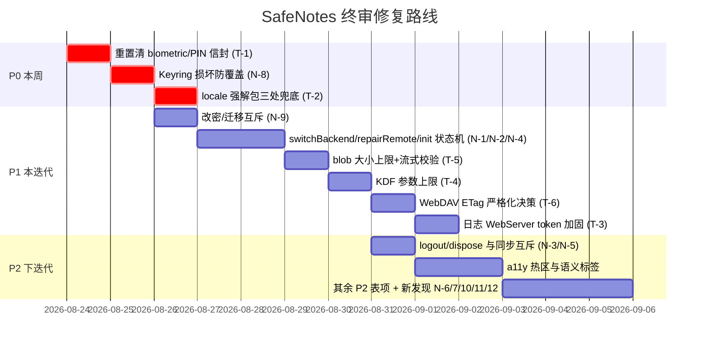

# SafeNotes 综合代码审查终审报告

> **审查时间**：2026-08-23 14:30 (+08:00)

---

## 0. 执行摘要

| 维度 | 结论 |
|---|---|
| 核心包（crypto/sync_engine/后端传输层） | 设计与实现质量高，历史 P0 修复基本到位；剩余缺口集中在 **WebDAV 退化路径** 与 **blob 下载无大小上限** |
| 应用层（lib/） | 最大真实风险是 **重置本地数据不清生物识别/PIN 信封**（比原报告更严重）和 **locale 强解包崩溃**（两处） |
| 原报告可信度 | 约 70% 条目属实；约 20% 明显夸大（前提或威胁模型不成立）；约 10% 不成立或已过时 |
| 本次新发现 | 11 个原报告均未提及的真实缺陷（其中 keyring 账本损坏覆盖、改密/迁移并发竞态值得优先关注） |

### 最需要立即处理的问题（综合排序）

1. **N-1 重置本地数据不清生物识别/PIN 信封**（原 P0-4，实况更严重：旧 PIN 可跨重置解锁新 vault）
2. **N-8 Keyring.load() 把"账本损坏"当"未初始化"，createNew() 无防覆盖检查** → 潜在不可逆全库数据丢失
3. **A-1 locale 映射强制解包崩溃**（settings.dart + general_settings_page.dart 两处，非标系统区域即白屏）
4. **N-9 改密码独立 persist 与同步迁移事务无互斥** → 极端并发下账本回写旧 epoch，重启后全库不可解
5. **K-1 日志 WebServer 弱 token + 无速率限制 + CORS \***（缓解：仅 dev 自动启动、release 默认级别不落盘 token）
6. **K-3 getBlob 三后端均无响应体大小上限**（原报告只说 manifest/journal 校验后置，实际 blob 才是完全没校验的那条路）

---

## 2. 确认属实的真实问题（按修复优先级）

### P0 级（本周必修）

#### T-1 重置本地数据后生物识别/PIN 凭据残留【原 P0-4，属实且被低估】
- **证据**：`login.dart:762-795` 重置流程只做删库 + `PreferencesStorage.clearVaultRelatedKeys()`；后者（`preference_and_config.dart:162-168`）只删一个 SharedPreferences key，注释自认"biometric 开关保留"。secure storage 共 6 个凭据 key 全部残留：
  - 生物识别：`biometric_auth.dart:26,32`
  - PIN：`pin_auth.dart:184-187`
  - 唯一清理入口 `BiometricAuth.disable()` / `PinAuth.disable()` 在重置路径从未被调用（全局 grep 确认）。
- **加重情节（原报告未指出）**：重置后设置新密码时 `set_passphrase.dart:356 → Session.onPasswordSet → PinAuth.refreshCredential()`（`pin_auth.dart:333-356`）会**复用旧的 `_securePinWrapKey`** 给新密码重新封信封 ⇒ **知道旧 PIN 的攻击者无需新密码即可解出新 vault 口令**；叠加重置前以旧口令加密保留的快照备份（`login.dart:767-779`），构成"旧 PIN → 旧口令 → 解密快照"完整击穿链。`sync_diagnostics_page.dart:882-890` 有同款流程。
- **修复**：`_performLocalDataReset()` 末尾显式 `await BiometricAuth.disable(); await PinAuth.disable();`（并复位对应开关），两处调用点同修。

#### T-2 SettingsScreen 语言映射强制解包崩溃【原报告A-1，属实，范围更大】
- **证据**：`settings.dart:62` 仍为 `SafeNotesConfig.mapLocaleName[context.locale.toString()]!`。map 由 `_locales` 反转生成（`preference_and_config.dart:823-829`），key 仅含 14 个固定值；系统返回 `zh_HK`/`zh`/`en_GB` 等即 null 崩溃。**`general_settings_page.dart:32,36` 存在同型问题**（原报告漏报）。
- **修复**：`?? context.locale.languageCode` 兜底，三处同修。

#### T-3 日志 WebServer 弱 token + 明文落盘 + 无防护【原 P0-1，属实，暴露面略窄】
- **属实部分**：
  - token 为 6 位数字（`log_webserver.dart:170`，约 19.8 bit 熵），启动日志明文携带 token（`:185-188`），经内存缓冲进 `GET /logs`、经文件进 `/logfile` 和 `/api/download/all`（ZIP 打包 db+sp+journal+全部日志）；
  - **监听地址为 `InternetAddress.anyIPv4`**（`log_webserver.dart:156`，即 0.0.0.0 所有网卡，140500 报告补充的这一点属实），局域网内任意设备可达；
- **修复**：release 构建默认禁用logwebserver，即使打开开发者模式，调试面板仅显示状态和日志tab。

### P1 级（本迭代修）

#### T-4 备份头 KDF 参数无上限【原 P0-3，属实，建议降 P1】
- `parse_import.dart:157-164` 只校验 `iterations > 0`，`memoryKiB/parallelism` 完全未校验；`backup_file.dart:162-170` 在密码验证**之前**就把参数传给 Argon2/PBKDF2。恶意 snbak 可挂死/OOM。触发前提是诱导用户导入恶意文件（本地攻击面），故 P1 更合理（140500 报告亦自评"自己导入的只可能是自己的备份"）。salt 有长度校验可作对照补齐。
- **修复建议值**（采纳 140500 报告）：`iterations ≤ 600_000`、Argon2 `t ≤ 5`、`memoryKiB ≤ 256*1024`、`parallelism ≤ 8`，并在解密前校验 payload 长度。

#### T-5 远端响应体大小校验后置 + getBlob 完全无校验【原 P0-6，属实且被低估】
- `http_util.dart:120-121` `Response.fromStream` 已把全量字节收进内存后才在各后端调 `checkRemoteReadSize`（64MB，`sync_backend.dart:277-278`）。
- **原报告遗漏**：三个后端的 **getBlob 连后置校验都没有**（`webdav_backend.dart:392-398`、`safe_server_backend.dart:295-306`、`local_fs_backend.dart:152-157` 直接返回 bodyBytes/readAsBytes）——blob 才是真正的大文件下载路径。
- **修复**：`client.send` 后流式累加边收边计数超限中断；给 blob 补上限。

#### T-6 WebDAV ETag 探测失败退化为 hash 仍放行【原 P0-2，机制属实，降 P1】
- `webdav_backend.dart:324-326,338-341`：无 etag 时用 sha256(content) 伪造 If-Match，忽略 If-Match 的服务器上乐观锁失效、多端静默覆盖。
- **降级理由**：有 `_probeEtagSupport()` 探测 + 一次性警告（`:184-222`），警告文案明示覆盖风险，代码注释文档化该退化；主流坚果云/NextCloud 均支持 ETag。附带发现：`_etagSupported` 字段本身不影响任何分支逻辑（只打日志），若服务器"有时返回有时不返回" etag，行为会在两种 etag 语义间漂移——建议让探测结果参与决策（拒绝同步或强制诊断页标红）。注意（采纳 140500 报告）：严格化前需对坚果云/Nextcloud 等常见非标 WebDAV 服务补充 ETag 行为回归测试，避免一刀切拒绝破坏现有可用后端。

#### T-7 switchBackend 半残状态【新发现 N-1，见 §5】

#### T-8 repairRemote 失败路径状态卡死【新发现 N-2，见 §5】

### P2 级（下迭代消化，确认为真的部分）

| 编号 | 问题 | 核实结论 |
|---|---|---|
| T-9 | `Session.login` fire-and-forget（`session.dart:26`，内部两个 async 未 await，调用方无法 await） | 属实但后果轻：幂等刷新、下次登录自愈；真正的风险是未捕获异步错误。降 P2，补 `await` 或显式 `unawaited()` |
| T-10 | 异常消息内嵌 `res.body`（webdav:311-313 等）进日志文件 | 属实但是卫生问题：body 是用户自己配置的服务端返回文本，不含凭据本体；WebServer 有 dev 门控。降 P2 |
| T-11 | `cache_manager.dart:19-23` `deleteSync(recursive:true)` UI isolate 同步阻塞 + 粒度过粗 | 属实低危，改异步删除。补充（140500 报告）：桌面端 `getTemporaryDirectory()` 返回系统级用户 Temp 目录而非应用沙盒，递归删除确有波及同目录第三方临时文件的风险；移动端为应用私有缓存目录，风险限于自身 |
| T-12 | 设备 ID 回落：Linux machineId 为 null 时产生 `linux-null`；未知平台用时间戳每次冷启不同；缓存不持久化 | 部分属实（android-null 不成立，Android id 非空 API）；字段明示仅用于诊断，降 P2。修复方向（采纳 140500 报告）：首启生成随机 UUID 持久化到 prefs 作统一回落值 |
| T-13 | `note_edit_history.dart:40` late 未初始化即 record 会抛 | 属实，当前调用方先 init，低危 |
| T-14 | 编辑快照全文副本 ×100 步的内存开销 | 属实，有界但可观 |
| T-15 | note_diff <50k 主线程 diff 可能卡顿 | 部分属实，有 isolate 兜底 |
| T-16 | `file_handler.dart:302` writeAsStringSync | 属实（181 行引用有误）；另有 scheduled_task.dart 四处同类 |
| T-17 | 剪贴板复制口令无超时清理 | 属实（实际位置 `add_edit_note.dart:503`，原报告写的 62 行不对）；Android 10+ 已有限制 |
| T-18 | `backup_setting.dart:60` reload() 未 await | 属实，影响极小 |
| T-19 | `note_version.dart:113-122` fromJson 全部 `?? ''` 静默降级 | 属实，解密失败显示空白版本 savedAt=0 |
| T-20 | zxcvbnm 仅英文词典，中文口令强度虚高 | 属实 |
| T-21 | `backupDirectory` 无路径校验 | 属实但来源是系统文件选择器，风险很低 |
| T-22 | `getTextDirecton` 拼写错误（应为 getTextDirection）【采纳自 140500 报告，已核实】 | 属实：`text_direction_util.dart:20` 定义 + note_widget/note_card_body/search_widget 共 7 处调用；纯命名问题（私有工具函数，无功能影响），重命名即可 |
| T-23 | 401 与网络错误混为一谈【采纳自 0821 报告 B-M3，已核实仍未修】 | 属实：全仓无 AuthenticationException，401 与网络抖动同抛 `BackendUnavailableException`（webdav_backend.dart:303/311、safe_server_backend.dart:196-198），引擎对该类型统一重试 → 认证失效也被无意义重试 3 次。应加 retryable 标志或独立异常类型 |
| T-24 | readAllNotesIncludingDeleted 缓存重建竞态【0821 M-03，已核实，后果降级】 | 部分属实：await 窗口内并发写的条目会从重建后的缓存中消失（database_handler.dart:340-342,1035-1040）；但 **DB 行已落库非数据丢失**，后果是缓存陈旧至下次失效重建（与 :342 注释假设矛盾）。修复：`_cacheRebuilding` 标志或重建后二次合并 |
| T-25 | exportAll 不导出墓碑，已删笔记重导入后复活【0821 L-04，已核实】 | 属实：exportAll 走 `readAllNotes()` 过滤 `!deleted`（database_handler.dart:2444,980），导入侧直接 fromJson 还原（parse_import.dart:37/57）→ 备份-恢复循环中删除状态丢失。改用 `readAllNotesIncludingDeleted()` 或导出墓碑列表 |
| T-26 | 明文笔记标题经 `/api/memory` 局域网暴露【0821 L-05，已核实】 | 属实：`cachedNoteSummaries` 返回解密标题明文（database_handler.dart:159-174）→ `getMemorySnapshot()`（sync_service.dart:1026）→ LogWebServer `/api/memory`（log_webserver.dart:262,347-348），仅有弱 token 保护、标题零脱敏。与 T-3 一并修复：该端点返回 hash/长度即可 |
| T-27 | journal 上传侧无大小限制 + 远端对象名无校验【0821 L-09/L-10，已核实】 | 属实：`syncToRemote` 整体读入日志文件加密上传无上限（journal.dart:998,1008，下载侧反而有 checkRemoteReadSize）；`fetchRemoteEntries`（journal.dart:1042-1069）对 listJournalObjects 返回名仅按 `.json` 后缀过滤。与 T-5/hash 白名单同批加固 |
| T-28 | 死代码与公开 State 类【0821 M-13，已核实全部属实】 | `Style.buttonTextStyle`（styles.dart:21）全仓无调用；`HomeDrawerState`/`ExportBackupDialogState`/`SearchWidgetState` 均无外部引用；`note_widget.dart:27/37` sessionStateStream 为必传死参数。清理+私有化 |
| T-29 | 三处 URL 占位符指向同一 GitHub 地址【0821 L-33，已核实】 | `preference_and_config.dart:729,730,744` `_githubUrl/_faqsUrl/_playStorUrl` 均为同一地址。**发布前必改** |
| T-30 | logout 与在途保存竞态【0821 M-08，主路径已被规避，残留窄窗口】 | 主流程不成立：`main.dart:426-427` 先完成草稿保存再进 `Session.logout()`。残留风险仅限手动保存在途时恰好超时登出，且失败抛 DataKeyNotSetException 有 toast 兜底、静态编辑态保留——非静默丢失。P3，处置并入 N-3（logout 与同步互斥时一并考虑编辑器空闲信号） |

**0821 报告其余低优先级项采信说明**（未逐行复验，按其报告原文采信）：L-12 url_launcher scheme 白名单、L-16 List.removeAt(0) O(n)、L-25 autofocus、L-27~32 重复代码/魔法数字、L-35~36 a11y 补充、L-37~39 i18n 残留——均为 P3 质量/体验项。其 §五 测试覆盖评估与 §六 依赖健康度（5 个 major 版本落后包）结论合理，建议随迭代消化。

### a11y / 架构 / UX 确认属实清单（原报告 A/B 组）

**仍然成立的：**
- 触控热区：`styles.dart:83-89` kInputIconButton Size.zero；`search_widget.dart:140-146` 清除按钮裸 GestureDetector；`note_color_picker.dart` 尺寸已改 48px 但仍无 Semantics
- 语义标签：PIN 退格键裸 InkWell+Icon（`pin_keyboard.dart:411-426`）；home 多选退出 ✕ 无 tooltip（`home.dart:1130-1134`）；theme/notes color setting 色块无 Semantics
- 架构：`editor_state.dart:21-39` 静态可变变量；`app_theme.dart:32` 顶层 `isMonochromeMode`
- `home.dart:104-105` 双 ScrollController 切换视图丢滚动位置
- `sync_service.dart` 服务层错误消息大量 `.tr()`（:426,:450,:485-604 等）
- FileHandler 业务/UI 耦合（`file_handler.dart:149,214`）——但所有调用前已有 `context.mounted` 守卫并有 TODO 自认，严重度低于原报告表述

**UX 易用性（UIUX-REVIEW 中仍成立的）：**
- AppBar 无标题/计数（`home.dart:385-395`）
- 过滤指示器纯文本不可点清除（`home.dart:1067-1080`，注释自认）
- 缺"按标题 A-Z"排序（现有六开关中组合不出）
- 卡片无 hover 快捷操作、无 Dismissible 滑动手势（全库 grep 确认）
- 删除无撤销 snackbar（软删除入回收站可恢复，作为缓解；恢复提示也被注释掉）
- 搜索仅 title+description 子串匹配（`home.dart:1020-1031`），无标签维度/高亮/结果计数
- 笔记页无 Markdown 工具栏、无 Saving/Saved 指示（`_isSaving` 状态位存在但未接 UI）
- "锁定"= 只读且不二次验证身份（`add_edit_note.dart:525-538`）
- 星标/删除藏在 NoteAction sheet（`note_actions_sheet.dart:102-146`）
- 无 Duplicate、单条导出 .md/.txt、分享面板
- 桌面快捷键仅编辑器内 Ctrl+Z/Y，无全局 Shortcuts/Actions

---

## 5. 原报告均未提及的新发现问题（本次独立审计发现）

### N-1【高】switchBackend 中途失败后同步子系统半残
`sync_service.dart:756-759`：旧 backend 先 close、`_backend` 已替换，然后才 `backend.init()`。init 抛出时：① 旧后端不可恢复、无回滚；② 若切换前 `_backendReady == true`，标志保持 true，后续 `sync()` 跳过惰性初始化分支，直接用未 init 的新后端跑引擎（正是注释里 Bug A 描述的症状）；③ `_engine` 仍是持有已关闭旧后端的旧实例。**修复**：init 成功后再替换 `_backend`；失败时回滚引用并置 `_backendReady = false`。

### N-2【中高】repairRemote 多个失败早退不恢复状态，UI 永久卡"syncing"
`sync_service.dart:562` 入口置 `status: syncing`，但 `:594-608`、`:626-635` 的 BackendUnavailableException/Exception catch 直接 return 不调 `_updateState`，finally 只复位 `_syncInProgress`。StreamBuilder 驱动的 UI 将持续显示同步中直到下次手动同步成功。

### N-3【中高】logout/dispose 不与进行中的同步互斥
`switchBackend` 有"同步中拒绝切换"防护（:747），但 `logout()`（:392-403）和 `dispose()`（:351-364）完全没有。inactivity 超时锁屏 → logout 会在 `engine.sync()` 执行中途 close backend/journal，journal 写入途中关闭存在水位竞态。**修复**：logout/dispose 前等待 `_syncInProgress` 完成或加入同一互斥域。

### N-4【中】initialize 中 `_openJournal` 抛异常残留旧 engine 指向已关闭资源
`sync_service.dart:193-217`：幂等化清理先关旧 journal/backend，随后 `_openJournal` 失败则函数中断，`_engine` 仍是旧实例（其内部资源已被 close），后续 `sync()` 判 `engine != null` 通过并对已关闭句柄操作。

### N-5【中】应用退出链路不包含 SyncService.dispose
`main.dart:278-288` `_shutdown()` 只停 LogWebServer 和日志文件。配置了同步的用户直接退出应用时，journal 内存缓冲未 flush 条目丢失、backend 连接不显式关闭。

### N-6【低中】dispose 对同一 SessionConfig 双重 dispose
`main.dart:322-330`：`_prevSessionConfig` 与 `_cachedSessionConfig` 始终同一实例，State.dispose 时连续两次 dispose。若 SessionConfig.dispose 非幂等会在 dispose 阶段抛错。

### N-7【低中】autoSync 不检查 isAutoSyncEnabled
`sync_service.dart:660-662` 只检查总开关 `isSyncEnabled`；用户关闭"自动同步"仅保留手动后，每次 app 回前台 `resumeCallBack`（`main.dart:211-216`）仍被动发起远端同步，违背用户设置。

### N-8【高】Keyring.load() 把"账本损坏"当"未初始化"，createNew() 无防覆盖检查
`packages/core/lib/src/sync/keyring.dart:231-235`：JSON 损坏 catch 后 return null（注释自认混沌测试场景）；`isInitialized()`(:917) 因此 false；`createNew()`(:448) 对已有（损坏）账本无任何防覆盖检查直接 persist 新 dataKey ⇒ sync_meta 单键被覆盖后旧 wrappedDataKey 丢失，**存量全部密文永久不可解**。"防御性吞异常"在此成为破坏性降级路径。**修复**：区分"损坏"与"缺失"；损坏时 createNew 必须要求显式确认或拒绝。

### N-9【中高→条件性】changePassword 的独立 persist 可绕过迁移事务重开 B1 崩溃窗
`keyring.dart:881`：改密码的账本写入是事务外独立 setMeta，core 内无互斥原语串行化它与 scenario-c/d 迁移事务。UI 层改密码（`change_passphrase.dart:394-398`）与后台 autoSync 迁移并发时：迁移提交后 `changePassword.persist` 把账本回写成旧 epoch + 旧包裹 → 重启 unlockLocal 解出旧 dataKey 解不开新密文 → **全库不可解**。窗口窄（需精确并发）但后果是 B1 级别。**修复**：账本轮换统一走同一互斥域或在 engine 层持有迁移锁期间拒绝 changePassword。附带同类问题：两个并发 changePassword 是 last-writer-wins。

### N-10【中】unlockLocal 把一切解包异常归类为"密码错误"
`keyring.dart:572-586`：`on Exception` 一律抛 WrongPasswordException——base64 解码 FormatException、平台 crypto 初始化失败同样落入。账本字段损坏时用户被反复提示"密码错误"无限重试，真实原因被吞。应区分解码错误与 GCM 认证失败。

### N-11【低】Journal flush 两处一致性瑕疵
- `journal.dart:689-691`：flush 快速返回路径 `await _writeChain` 挂起期间 append 可再次填充 `_pending`，返回后 readAll/syncToRemote/close 拿到缺条目快照（:685-687 注释宣称已修的竞态只堵了一半）。
- `journal.dart:704-711`：_doFlush 先摘除 pending 再写盘，写失败被 :695 catchError 吞掉，batch 已进 `_entries` 但未落盘——entries getter 谎报持久化进度，且补写依赖后续恰好有新 append。

### N-12【低】journal findIncompleteOperations 无 opId 时同类型 start 静默覆盖
`journal.dart:906`：配对算法假设"同类型至多一个在途操作"但不断言不告警，违反时更早悬挂 start 从崩溃恢复探测结果中无声消失。

---

## 6. 综合修复路线图

### 一览表

| 优先级 | 编号 | 任务 | 文件 |
|---|---|---|---|
| P0 | T-1 | 重置清理生物识别/PIN 信封（含 sync_diagnostics_page 同款路径） | login.dart / preference_and_config.dart |
| P0 | N-8 | Keyring 账本损坏区分处理 + createNew 防覆盖 | packages/core keyring.dart |
| P0 | T-2 | locale 映射 null 兜底（settings.dart + general_settings_page.dart×2） | settings.dart / general_settings_page.dart |
| P1 | N-9 | 改密码与迁移事务互斥 | packages/core keyring.dart / sync_engine.dart |
| P1 | N-1/2/4 | switchBackend/repairRemote/initialize 失败路径状态一致性 | lib/sync/sync_service.dart |
| P1 | T-5 | 流式大小校验 + getBlob 上限 | http_util.dart / 三后端 |
| P1 | T-4 | 备份头 KDF 参数上限 | parse_import.dart |
| P1 | T-6 | WebDAV ETag：探测结果参与决策（拒绝或标红） | webdav_backend.dart |
| P1 | T-3 | 日志 token ≥128bit / 不入日志 / 限频 / CORS 收紧（含 T-26 `/api/memory` 标题脱敏） | log_webserver.dart |
| P2 | 其余 | 见 §2 P2 表（含 0821 采纳项 T-23~T-29，其中 T-25 墓碑导出、T-29 占位符 URL 建议优先）+ §5 N-6/7/10/11/12 | — |

## 7. 维持搁置（记录在案）

- 口令静态 String 驻留内存（0810 高8）：需 Uint8List 化大规模改造
- v5 容器 header 无密码学绑定（0810 B-M9）：设计取舍，已在设计文档声明威胁模型前提下接受
- i18n 双轨硬编码中文：抽查已基本收敛到 `.tr()`，残余仅在注释与日志，无需专项治理
- Zxcvbnm 单例缓存：性能取舍非缺陷

---

*本报告由 ox-alpha 基于 2026-08-23 当前源码逐条核实生成，取代此前四份报告中相互冲突的结论；后续修复请以本文档 §2/§5 的编号为准建立 issue。*
