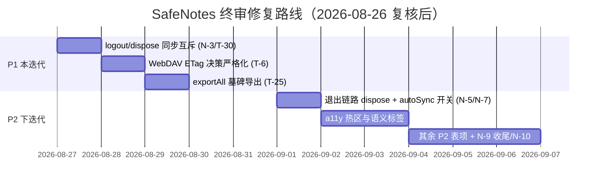

# SafeNotes 综合代码审查终审报告

> **审查时间**：2026-08-23 14:30 (+08:00)
> **复核清理**：2026-08-26 —— 已逐条对照当前源码复核，删除已修复/不成立的条目（T-1/T-2/T-3/T-4/T-5/T-26、N-1/N-2/N-4/N-6/N-8/N-11/N-12），编号保留原号不重排以便追溯。

---

## 0. 执行摘要

| 维度 | 结论 |
|---|---|
| 核心包（crypto/sync_engine/后端传输层） | 历史 P0 缺口已基本修复到位：KDF 参数上限、blob 流式大小校验、keyring 损坏防覆盖、journal 配对算法均已落地；残留缺口为 **N-9 改密码乐观校验未完全闭环** 与 **N-10 解密层异常仍误报为密码错误** |
| 应用层（lib/） | locale 强解包、重置不清凭据、日志 WebServer 弱 token/release 门控均已修复；剩余真实风险集中在 **logout/dispose 不与同步互斥（N-3）**、**退出链路缺 SyncService.dispose（N-5）**、**autoSync 无视自动同步开关（N-7）** |
| 原报告可信度 | 约 70% 条目属实；约 20% 明显夸大；约 10% 不成立或已过时 |

### 复核后仍需处理的问题（按优先级）

1. **N-3 logout/dispose 不与进行中的同步互斥** → inactivity 超时登出可在 `engine.sync()` 执行中途关闭 backend/journal
2. **N-9 改密码 persist 已加乐观校验，但校验到写入间仍有 TOCTOU 窗口**，且并发 changePassword 仍 last-writer-wins
3. **T-6 WebDAV ETag 探测结果不参与决策**，无 etag 时仍退化为 hash 伪造 If-Match
4. **N-5 应用退出链路不含 SyncService.dispose** → journal 内存缓冲未 flush
5. **N-7 autoSync 只检查总开关，无视 isAutoSyncEnabled**
6. **T-25 exportAll 不导出墓碑** → 备份-恢复循环中删除状态丢失；**T-29 三处占位符 URL 发布前必改**

---

## 2. 确认属实的真实问题（按修复优先级）

### P0 级

原 P0 条目（T-1 重置凭据残留、T-2 locale 强解包、T-3 日志 WebServer）经复核均已在当前源码修复，条目已移除。

### P1 级（本迭代修）

#### T-6 WebDAV ETag 探测失败退化为 hash【部分缓解，待决策严格化】
- `webdav_backend.dart:342-344`：无 etag 时仍用 `_computeContentEtag`（sha256(content)，`:1037`）伪造 If-Match，忽略 If-Match 的服务器上乐观锁失效、多端静默覆盖。
- 现状：已有 `_probeEtagSupport()` 探测 + `isEtagSupported` 公开 getter + 一次性警告（`:175-225,322-330`），警告文案明示覆盖风险——原修复计划口径（告警+暴露状态）已达成。
- **待办**：让探测结果参与决策（拒绝同步或强制诊断页标红）。注意：严格化前需对坚果云/Nextcloud 等常见非标 WebDAV 服务补充 ETag 行为回归测试，避免一刀切拒绝破坏现有可用后端。

#### N-9 / N-10 见 §5

### P2 级（下迭代消化）

| 编号 | 问题 | 核实结论 |
|---|---|---|
| T-9 | `Session.login` fire-and-forget（`session.dart:26`，内部两个 async 未 await，调用方无法 await） | 属实但后果轻：幂等刷新、下次登录自愈；真正的风险是未捕获异步错误。降 P2，补 `await` 或显式 `unawaited()` |
| T-10 | 异常消息内嵌 `res.body`（webdav_backend.dart:316-318 等）进日志文件 | 属实但是卫生问题：body 是用户自己配置的服务端返回文本，不含凭据本体；WebServer 有 dev 门控。降 P2 |
| T-11 | `cache_manager.dart:22` `deleteSync(recursive:true)` UI isolate 同步阻塞 + 粒度过粗 | 属实低危，改异步删除。桌面端 `getTemporaryDirectory()` 返回系统级用户 Temp 目录而非应用沙盒，递归删除确有波及同目录第三方临时文件的风险；移动端为应用私有缓存目录，风险限于自身 |
| T-12 | 设备 ID 回落：Linux machineId 为 null 时产生 `linux-null`（device_id.dart:148）；未知平台用时间戳每次冷启不同（`:152`）；缓存不持久化 | 部分属实（android-null 不成立，Android id 非空 API）；字段明示仅用于诊断，降 P2。修复方向：首启生成随机 UUID 持久化到 prefs 作统一回落值 |
| T-13 | `note_edit_history.dart:40` late 未初始化即 record 会抛 | 属实（结构性），当前调用方先 init，低危 |
| T-14 | 编辑快照全文副本 ×100 步的内存开销（note_edit_history.dart:31 `_kMax=100`） | 属实，有界但可观 |
| T-15 | note_diff <50k 主线程 diff 可能卡顿（note_diff.dart:128-143 有 isolate 兜底） | 部分属实 |
| T-16 | `file_handler.dart:303` writeAsStringSync；另有 scheduled_task.dart 四处同类（:156,:179,:228,:261） | 属实 |
| T-17 | 剪贴板复制口令无超时清理（add_edit_note.dart:546 `_copyAll`） | 属实；Android 10+ 已有限制 |
| T-18 | `backup_setting.dart:60` reload() 未 await | 属实，影响极小 |
| T-19 | `note_version.dart:113-122` fromJson 全部 `?? ''` 静默降级 | 属实，解密失败显示空白版本 savedAt=0 |
| T-20 | zxcvbnm 仅英文词典，中文口令强度虚高（passphrase_util.dart:36） | 属实 |
| T-21 | `backupDirectory` 无路径校验 | 属实但来源是系统文件选择器，风险很低 |
| T-22 | `getTextDirecton` 拼写错误（应为 getTextDirection） | 属实：`text_direction_util.dart:20` 定义 + note_card_body/note_widget/search_widget 共 7 处调用；纯命名问题，重命名即可 |
| T-23 | 401 与网络错误混为一谈 | 属实：全仓无 AuthenticationException，401 与网络抖动同抛 `BackendUnavailableException`（webdav_backend.dart:315-319、safe_server_backend.dart:198-202 等），引擎对该类型统一重试 → 认证失效也被无意义重试。应加 retryable 标志或独立异常类型 |
| T-24 | readAllNotesIncludingDeleted 缓存重建竞态 | 属实：缓存为 null 时并发调用各自全量解密并先后覆盖 `_notesCache`（database_handler.dart:1052-1073），无 `_cacheRebuilding` 标志、无二次合并；DB 行已落库非数据丢失，后果是缓存陈旧至下次失效重建 |
| T-25 | exportAll 不导出墓碑，已删笔记重导入后复活 | 属实：exportAll 走 `readAllNotes()` 过滤 `!deleted`（database_handler.dart:999-1011,2465-2470），导入侧直接 fromJson 还原 → 备份-恢复循环中删除状态丢失。改用 `readAllNotesIncludingDeleted()` 或导出墓碑列表 |
| T-27 | journal 远端对象名仅按 `.json` 后缀过滤 | 上传侧无界问题不成立：journal 有 100KB 滚动上限（journal.dart:77-80,743-747）天然有界；但 `fetchRemoteEntries`（journal.dart:1044-1074）对列举返回名仅按 `.json` 后缀过滤（三后端同款：webdav:782、safe_server:738、local_fs:399），与对象名白名单加固可同批处理 |
| T-28 | 死代码与公开 State 类 | 属实：`Style.buttonTextStyle`（styles.dart:21-23）全仓无调用；`note_widget.dart:28,40` sessionStateStream 为必传死参数；`HomeDrawerState`/`ExportBackupDialogState`/`SearchWidgetState` 均无外部引用。清理+私有化 |
| T-29 | 三处 URL 占位符指向同一 GitHub 地址 | 属实：`preference_and_config.dart:741,742,756` `_githubUrl/_faqsUrl/_playStorUrl` 均为同一地址。**发布前必改** |
| T-30 | logout 与在途保存竞态 | 主路径已规避：main.dart 先保存草稿再 `Session.logout()`；残留风险仅限手动保存在途时恰好超时登出，失败抛 DataKeyNotSetException 有 toast 兜底。P3，处置并入 N-3 |

**0821 报告其余低优先级项采信说明**（未逐行复验，按其报告原文采信）：L-12 url_launcher scheme 白名单、L-16 List.removeAt(0) O(n)、L-25 autofocus、L-27~32 重复代码/魔法数字、L-35~36 a11y 补充、L-37~39 i18n 残留——均为 P3 质量/体验项。其测试覆盖评估与依赖健康度结论建议随迭代消化。

### a11y / 架构 / UX 确认属实清单

**仍然成立的（已复核）：**
- 触控热区：`styles.dart:75-93` kInputIconButton minimumSize Size.zero + shrinkWrap；`search_widget.dart` 清除按钮裸 GestureDetector；note_color_picker 尺寸 48px 但无 Semantics
- 语义标签：PIN 退格键裸 InkWell+Icon 无 semanticLabel（`pin_keyboard.dart:411-437`）；home 多选退出 ✕ 无 tooltip；theme/notes color setting 色块无 Semantics
- 架构：`editor_state.dart:21-39` 静态可变变量；`app_theme.dart:32` 顶层 `isMonochromeMode`
- `home.dart:105-106` 双 ScrollController 切换视图丢滚动位置
- `sync_service.dart` 服务层错误消息大量 `.tr()`
- FileHandler 业务/UI 耦合（`file_handler.dart:149,214`）——所有调用前已有 `context.mounted` 守卫并有 TODO 自认，严重度低于原报告表述

**UX 易用性（仍然成立的）：**
- AppBar 无标题/计数（`home.dart`）
- 过滤指示器纯文本不可点清除（注释自认）
- 缺"按标题 A-Z"排序
- 卡片无 hover 快捷操作、无 Dismissible 滑动手势
- 删除无撤销 snackbar（软删除入回收站可恢复，作为缓解）
- 搜索仅 title+description 子串匹配，无标签维度/高亮/结果计数
- 笔记页无 Markdown 工具栏、无 Saving/Saved 指示（`_isSaving` 状态位存在但未接 UI）
- "锁定"= 只读且不二次验证身份（`add_edit_note.dart:565-581`，解锁同样零验证）
- 星标/删除藏在 NoteAction sheet
- 无 Duplicate、单条导出 .md/.txt、分享面板
- 桌面快捷键仅编辑器内 Ctrl+Z/Y，无全局 Shortcuts/Actions

---

## 5. 新发现问题（本次审计发现，经复核后保留）

> 原 N-1/N-2/N-4/N-8/N-12 经复核已在当前源码修复；N-6（SessionConfig 双重 dispose）核实为无害（`SessionConfig.dispose` 内部 `StreamController.close()` 幂等）；N-11 两处中第一处已修、第二处为注释明示的设计取舍——均已移除。

### N-3【中高】logout/dispose 不与进行中的同步互斥
`switchBackend` 有"同步中拒绝切换"防护（sync_service.dart:805-815），但 `logout()`（:412-423）和 `dispose()`（:371-384）完全没有：只 cancel timer 后立即 `_closeJournal()` + `_backend?.close()`。inactivity 超时锁屏 → logout 会在 `engine.sync()` 执行中途 close backend/journal，journal 写入途中关闭存在水位竞态。已有 `waitForSyncCompletion()`（:788-795）可用但未被调用。**修复**：logout/dispose 前等待 `_syncInProgress` 完成或加入同一互斥域。

### N-5【中】应用退出链路不包含 SyncService.dispose
`main.dart:250-260` `_shutdown()` 只停 LogWebServer 和日志文件，全链路无 `SyncService.instance.dispose()` 调用。配置了同步的用户直接退出应用时，journal 内存缓冲未 flush 条目丢失、backend 连接不显式关闭。

### N-7【低中】autoSync 不检查 isAutoSyncEnabled
`sync_service.dart:716-718` autoSync() 只检查总开关 `isSyncEnabled`；`isAutoSyncEnabled` 仅在诊断快照被读取展示。用户关闭"自动同步"仅保留手动后，每次 app 回前台 `resumeCallBack` 仍被动发起远端同步，违背用户设置。

### N-9【中高→已缓解，残留窄窗口】changePassword 乐观校验未完全闭环
现状（keyring.dart:913-931）：改密码写入前已新增乐观并发校验——重新 load DB 中最新账本，vaultId 或 dataKeyEpoch 不匹配即中止，盲写旧 epoch 的主路径已被拦截。**残留风险**：① 校验到 `persist` 写入之间仍有极小 TOCTOU 窗口（非真正事务/互斥）；② 两个并发 changePassword 仍 last-writer-wins。修复方向：账本轮换统一走同一互斥域或在 engine 层持有迁移锁期间拒绝 changePassword。

### N-10【低→大部分已修复，残留误判】unlockLocal 解密层异常仍归类为"密码错误"
现状：base64 格式损坏已正确分流为 `KeyringCorruptedException`（keyring.dart:604-607）。**残留**：信封长度不足/AAD 异常等非密码因素导致的解密异常（如 `SyncDecryptionException`）在 `_unwrapOrThrow`（:609-617）的 `on Exception catch` 中仍被归一化为 WrongPasswordException，账本字段损坏时用户被反复提示"密码错误"。应区分解码/GCM 认证失败与其他解密异常。

---

## 6. 综合修复路线图

### 一览表

| 优先级 | 编号 | 任务 | 文件 |
|---|---|---|---|
| P1 | N-3 | logout/dispose 与同步互斥（waitForSyncCompletion 复用） | lib/sync/sync_service.dart |
| P1 | T-6 | WebDAV ETag：探测结果参与决策（拒绝或标红） | webdav_backend.dart |
| P1 | T-25 | exportAll 导出墓碑 | database_handler.dart / parse_import.dart |
| P2 | N-9/N-10 | 改密码互斥收尾 + 解密异常分流 | packages/core keyring.dart |
| P2 | N-5/N-7 | 退出链路接入 SyncService.dispose + autoSync 检查开关 | main.dart / sync_service.dart |
| P2 | T-29 | 占位符 URL 替换（发布前必改） | preference_and_config.dart |
| P2 | 其余 | 见 §2 P2 表（T-9~T-28/T-30） | — |

## 7. 维持搁置（记录在案）

- 口令静态 String 驻留内存（0810 高8）：需 Uint8List 化大规模改造
- v5 容器 header 无密码学绑定（0810 B-M9）：设计取舍，已在设计文档声明威胁模型前提下接受
- i18n 双轨硬编码中文：抽查已基本收敛到 `.tr()`，残余仅在注释与日志，无需专项治理
- Zxcvbnm 单例缓存：性能取舍非缺陷
- 日志 WebServer 绑定 0.0.0.0 + CORS `*`：dev 门控 + 128-bit token 下风险可接受，token 经 URL query 传递会进浏览器历史为已知取舍

---

*本报告由 ox-alpha 基于 2026-08-23 当前源码逐条核实生成；2026-08-26 复核清理已修复/不成立条目。后续修复请以本文档 §2/§5 的编号为准建立 issue。*
